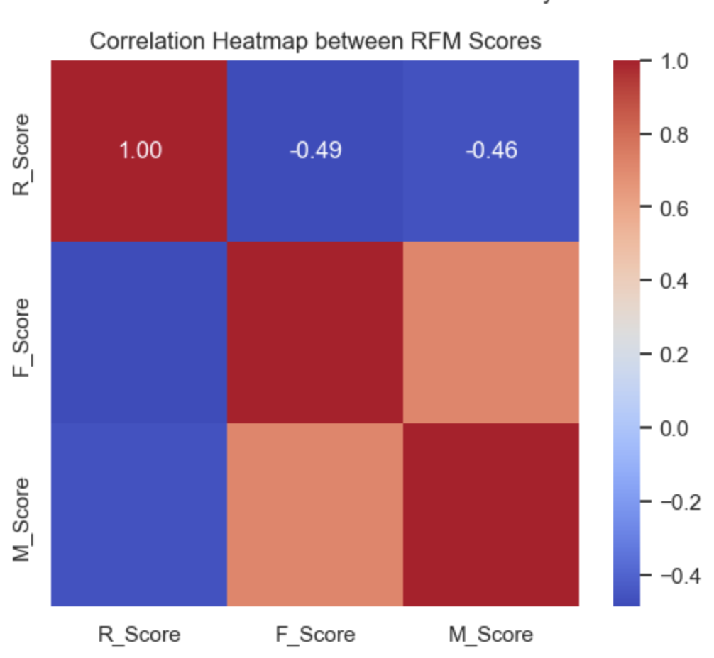
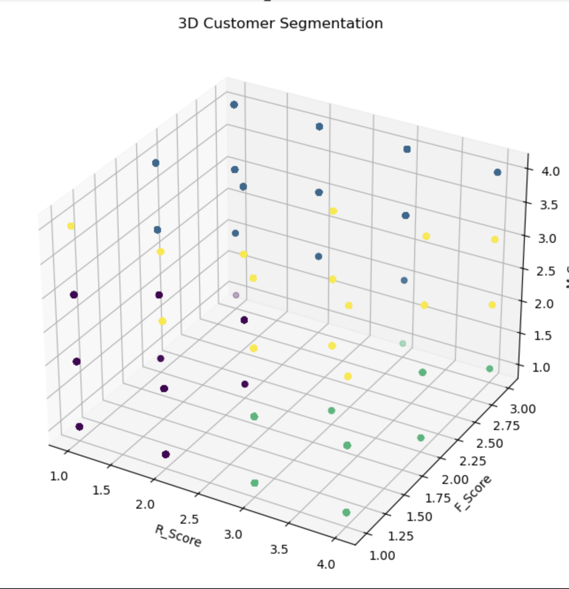

# 🧠 Customer Segmentation using RFM Analysis

This project applies **RFM (Recency, Frequency, Monetary)** analysis and **K-Means clustering** to segment customers of an eCommerce store, enabling data-driven marketing strategies and personalized engagement plans.

---

## 📌 Abstract

In this analysis, 500,000+ online retail transactions were examined to classify customers based on their purchase behavior. By calculating RFM scores and applying clustering algorithms, distinct customer groups were identified. This segmentation helps businesses allocate resources efficiently and improve customer retention through targeted strategies.

---

## ⚙️ Features

- Cleaned and preprocessed raw transactional data
- Calculated RFM metrics per customer
- Assigned scores using quartile binning
- Applied K-Means clustering and selected optimal K using Elbow Method
- Profiled customer segments
- Visualized behavior patterns with Python charts

---

## 🛠️ Technologies Used

- **Language**: Python (Jupyter Notebook)
- **Libraries**: pandas, numpy, matplotlib, seaborn, scikit-learn
- **Techniques**: RFM Analysis, Clustering (K-Means), Data Visualization

---

## 📥 Dataset Source

Dataset used from Kaggle:  
🔗 [eCommerce Transactions Dataset – Kaggle]([https://www.kaggle.com/datasets/carrie1/ecommerce-data](https://www.kaggle.com/datasets/carrie1/ecommerce-data))

---

## 📊 Visualizations

### 📌 RFM Score Distributions
The frequency distribution of Recency, Frequency, and Monetary scores after quartile binning. This helps understand how customers are distributed across each RFM dimension.

---

### 📌 Correlation Between RFM Scores
Heatmap showing correlation between R, F, and M scores. This helps identify whether a customer's recency relates to their frequency or monetary value.

---

### 📌 3D Customer Segmentation
A 3D scatter plot visualizing segmented customers based on their R, F, and M scores. Each point represents a customer, and color coding shows which segment they belong to.

---

